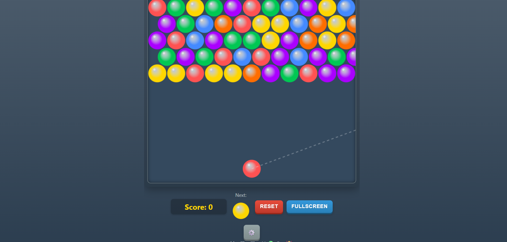

<p align="center">
  
</p>

<h1 align="center">🎯 Bubble Shooter Deluxe</h1>

<p align="center">
  💻 HTML5 • CSS3 • JavaScript  
  🎮 Arcade Style • Fullscreen Mode  
  ⚡ Smooth Animations & Collision Engine  
</p>

---

## 🕹️ Live Demo

🚀 Deploy using GitHub Pages and paste your link here:

```
https://Invisiblehqck.github.io/bubble-shooter-deluxe/
```

---

###🎮 Game Preview

#🎥 Gameplay Demo

<p align="center">
  <video src="./demo.mp4" width="450" controls></video>
</p>

#📸 Demo Image




---

## 🧠 Game Features

✔️ Fullscreen Gameplay  
✔️ Smooth Bubble Physics  
✔️ Collision Detection Engine  
✔️ Score Tracking System  
✔️ Responsive UI  
✔️ Clean Modern Gradient Theme  
✔️ Settings Panel  

---

## 🛠️ Tech Stack

- HTML5
- CSS3 (Custom Variables & Gradients)
- Vanilla JavaScript
- Canvas API

---

## 📂 Project Structure

```
📁 bubble-shooter-deluxe
 ┣ 📂 assets
 ┃ ┣ 📜 screenshot.png
 ┃ ┗ 📜 demo.gif
 ┣ 📜 index.html
 ┣ 📜 style.css
 ┣ 📜 script.js
 ┗ 📜 README.md
```

---

## 🚀 Installation

```bash
git clone https://github.com/Invisiblehqck/bubble-shooter-deluxe.git
cd bubble-shooter-deluxe
```

Save & Open `index.html` in your browser.

---

## 🎯 Core Mechanics

- Angle-based shooting system
- Grid-based bubble placement
- Color matching algorithm
- Recursive bubble clearing logic
- Score increment engine
- Floating bubble drop detection

---

## 🌌 Future Improvements

- 🔊 Sound Effects
- 🏆 High Score Leaderboard
- 📱 Mobile Touch Optimization
- 🌍 Multiplayer Mode
- 🎨 Theme Switcher

---

## 👨‍💻 Author

Built with precision & caffeine ☕  
**Invisiblehqck**

---

## ⭐ Show Support

If you like this project:

⭐ Star the repository  
🍴 Fork it  
🚀 Improve it  

---

<p align="center">
  
</p>
